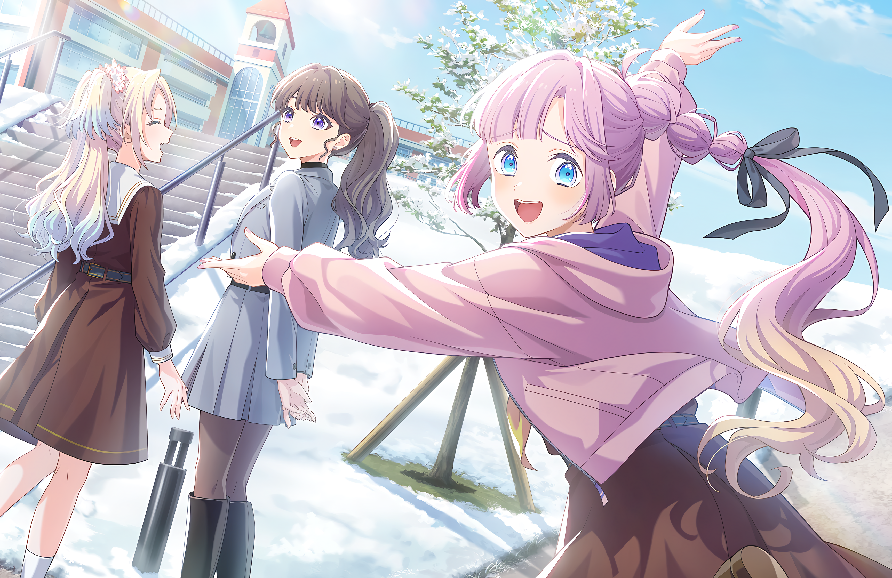

## 👋 Hi there, I'm canaria

I'm primarily a **Customer Engineer**, but I also wear an **Site Reliability Engineer** hat when needed.

- ✈️ Love traveling, especially to Japan.
- 🎤 Enjoy live concerts... イエッタイガーやめてください!!!
- 💻 I code for fun! You'll often find some quirky side projects here!

## Contact me

## Skills

## Tools & Platforms

## GitHub Stats

